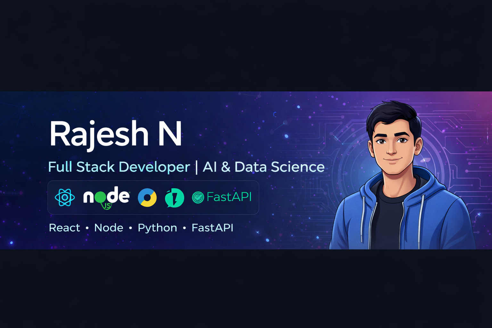

  

<h1 align="center">Hi ,I'm Rajesh N</h1>
<h3 align="center">Full Stack Developer | AI & Data Science Student | Problem Solver</h3>

  <a href="mailto:kit27.ad45@gmail.com">📧 Email</a> 
  <a href="https://linkedin.com/in/rajesh-n-4922622a6">🔗 LinkedIn</a>

## About Me
-  **B.Tech – Artificial Intelligence & Data Science (Pre-Final Year)**
-   KIT – Kalaignar Karunanidhi Institute of Technology, Coimbatore
-  **Freelance Full Stack Developer** (real client projects)
- Strong in **DSA, Full Stack Development & APIs**
- Built **6+ production-level web applications**

## Tech Stack

  

## Featured Projects
###  TNPSC Learning Hub (Full Stack)
**Tech:** React.js, Node.js, MySQL, Postman  
- Complete learning platform for TNPSC exam preparation  
- REST APIs for users, questions, videos & authentication  
- Fully responsive and optimized UI  

### Employee Management System
**Tech:** HTML, CSS, JavaScript, Python, MySQL  
- Authentication with JWT  
- Employee CRUD, role management & task tracking  
- Secure backend with API integration  

###  Dynamic School Website
**Tech:** HTML, CSS, JavaScript, Local Storage  
- Multi-page responsive UI  
- Login & signup without backend  
- Clean navigation and dynamic sections  

###  Productivity & Task Management App
**Tech:** React, JavaScript  
- Task tracking across categories  
- Sidebar navigation & dynamic UI  
- Real-time updates  

##  Experience
### Freelance Full Stack Developer (2025)
- Delivered **6+ real client projects**
- Worked with a senior developer (10+ yrs experience)
- Independent development & on-time delivery
- Followed real-world requirements and standards

##  Achievements
- GitHub Achievement – High project contribution
-  2nd Prize – Debugging Competition (KPR College)
-  Scopus Research Paper:  
  *“CNN–LSTM Based Cloudburst Warning System”*

##  Competitive Programming
-  **LeetCode**
  - Max Rating: **1600**
  - Solved: **300+**
  - Top **23.6% globally**
-  **CodeChef**
  - Rating: **1450 (2⭐)**
  - Solved: **370+**
-  Codeforces & Coding Ninjas experience

---

##  Certifications
- Coursera – 6+ Certificates
- Infosys – 3+ Certificates
- NPTEL – Soft Skill Development
- Internship Certification

---

##  Volunteering
- Mentored first-year students in coding & projects
- Donated blood **5+ times**
- Active in college events & workshops

                                                ###  “Code with purpose. Build with impact.”
